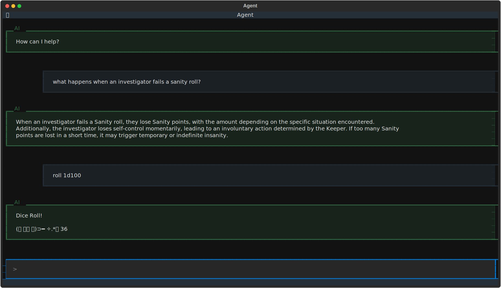

# README

A terminal-based AI assistant for helping with TTRPGs (Table Top Role-Playing Games).



## Table of Contents

- [Overview](#overview)
- [Setup](#setup)
- [Prerequisites](#prerequisites)
- [Installation](#installation)
- [Authors](#authors)

## Overview

This project is a work in progress and largely experimental. 

You can use the interface to:
 - ask questions about game rules, and get answers from the language model.
 - roll dice and get random numbers.

It's a terminal user interface (TUI) to a RAG Chatbot that will load your game rules into a vector database and 
provide a chat interface to the language model of your choice. 

### Built with

- [Textual](https://textual.textualize.io/) -TUI framework
- [LangGraph](https://www.langchain.com/) - Framework for LLM workflows
- [ChromaDB](https://www.trychroma.com/) - Vector database
- [D7](https://github.com/NunoCastanho/d7) - Dice rolling

## Setup

```bash
uv run main.py
```

### Prerequisites

- You'll need to either have an API key for your language model, or use a local model.
- [uv](https://docs.astral.sh/uv/)

### Installation

1. Clone the repository:

```bash
git clone https://github.com/username/rag-llm-tui.git
cd rag-llm-tui
```

2. Copy the example environment file and fill in the values for the environment variables.

```bash
cp .env.test .env
```

3. Create a directory for PDFs, and add this path to the `PDF_DIR` environment variable.

4. Install and run with uv

```bash
uv run main.py
```

## Usage

You can interact with the language model by typing your query in the terminal.

Once you have loaded your PDFs, you can ask questions about them.

## Development

Running tests:

```bash
uv run pytest tests
```

## Authors

- [Michael Medaglia](https://github.com/medaglia)
